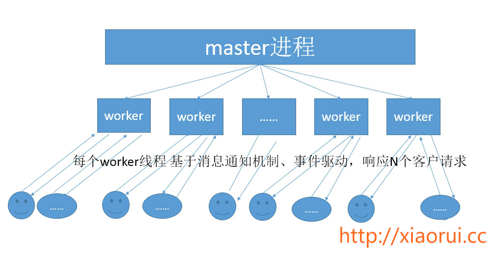

# 项目名:
`ProcessHandler`  

为避免被喷,这里提前申明下ProcessHandle的设计思想跟代码实现极其认真的`参考`并`抄袭` 开源gunicorn框架 [gunicorn官方](http://gunicorn.org/) . 换句话说ProcessHandle是基于gunicorn开发的.  

更多的内幕及后续的文档更新, 我会放在我博客里面, 有兴趣的朋友可以瞅瞅 [http://xiaorui.cc/?p=2219](http://xiaorui.cc/2015/10/25/%E7%AE%80%E5%8C%96gunicorn%E6%BA%90%E4%BB%A3%E7%A0%81%E6%89%93%E9%80%A0master-worker%E8%BF%9B%E7%A8%8B%E7%AE%A1%E7%90%86%E6%A1%86%E6%9E%B6/)

##用途:
简单理解为这是一个` Master Worker `框架. 可以说跟nginx的进程管理模式相似的.

工作原理:  
当ProcessHandle启动后，会有一个master进程和多个worker进程.master进程主要用来管理worker进程，包含：接收来自外界的信号，向各worker进程发送信号，监控worker进程的运行状态，当worker进程退出后(异常情况下)，会自动重新启动新的worker进程.   
对于每个worker进程来说，独立的进程，不需要加锁，所以省掉了锁带来的开销，同时在编程以及问题查找时，也会方便很多。其次，采用独立的进程，可以让互相之间不会影响，一个进程退出后，其它进程还在工作，服务不会中断，master进程则很快启动新的worker进程。当然，worker进程的异常退出，肯定是程序有bug了，异常退出，会导致当前worker上的所有请求失败，不过不会影响到所有请求，所以降低了风险。当然，好处还有很多，大家可以慢慢体会。  


另外说下`prefork`工作模型,每个worker进程都是从master进程fork过来.在master进程里面，先建立好需要listen的socket之后，然后再fork出多个worker进程，这样每个worker进程都可以去accept这个socket(当然不是同一个socket，只是每个进程的这个socket会监控在同一个ip地址与端口，在linux下是允许这么干的).  
我们模拟用户请求过来的场景, 当一个连接进来后，所有在accept在这个socket上面的进程，都会收到通知，而只有一个进程可以accept这个连接，其它的则accept失败.多个worker进程之间是对等的，他们同等竞争来自客户端的请求，各进程互相之间是独立的.一个请求，只可能在一个worker进程中处理，一个worker进程，不可能处理其它进程的请求. worker进程的个数是可以设置的，一般我们会设置与机器cpu核数一致.



##闲扯:

可能有些朋友在纳闷、疑惑. 怀疑我为毛又在造轮子,但我想说的是gunicorn代码理解起来不简单,里面还真有不少UNIX设计艺术在里面. 再提一句, gunicorn的代码质量很高,实现的prefork也很是优雅,但是他更多是为web framework打造的.当用gunicorn启动web应用的时候,其实gunicorn为后面的几个web做了各方面的适配. 那我如果只是想做个Master Worker这样的进程管理,那么gunicorn是做不到的,除非是你改gunicorn代码,如果又想基于刚才说的进程框架之上封装一个RPC或Restful Api服务,那么又咋办?  我的回答是,直接重写一个适合自己的.  我曾经视图改过gunicorn和uwsgi的代码,好融合我以前写过的RPC服务,但世事难料... ...  

不管是gunicorn or uwsgi的Master Worker ,Prefork 跟wsgi耦合的太紧密... 结果呢? 这项目就是结果!  

更多的内幕及后续的文档更新,我会放在我博客里面,有兴趣的朋友可以瞅瞅 [http://xiaorui.cc/?p=2219](http://xiaorui.cc/2015/10/25/%E7%AE%80%E5%8C%96gunicorn%E6%BA%90%E4%BB%A3%E7%A0%81%E6%89%93%E9%80%A0master-worker%E8%BF%9B%E7%A8%8B%E7%AE%A1%E7%90%86%E6%A1%86%E6%9E%B6/)

####要做的事情:

* 文档的更新,现在的项目说明是在是太过简陋.
* 要在ProcessHandler上开发一个高性能的RPC示例代码. 

####现在还存在的BUG:
* pid文件写入有问题
* 多实例控制问题

----

##文档说明

配置文件说明 config.py:
```
[DEFAULT]
#当收到kill信号后,几秒后干掉worker
graceful_timeout        = 3

#应用的环境变量
base_path               = . 

#日志根目录
log_path                = .

#是否支持多实例
single_instance         = false

[jobexecute]
#是否需要扔到后端
daemonize               = true

#进程名字
proc_name               = jobexecute

#Master主进程PID
pidfile                 = %(base_path)s/master.pid

#日志位置
log_file                = %(log_path)s/master.log

#最大的请求数,也可以理解为是调用测试
max_requests            = 10000

#启动的进程数目,每个进程都是一个实例
number_workers          = 2

```
----

##使用方法:

首先需要安装ProcessHandler所需要的关联模块,尽量使用标准库来实现.

```
pip install requirement.txt
```

下面是主要处理任务模块.  根据自己的场景，直接copy代码就可以了.

```
# coding=utf-8

import time
import logging
import traceback

from ProcessHandler.lib.log import setup_file_logging
from ProcessHandler.lib.workers.sync import SyncWorker


class JobExecute(SyncWorker):

    LOGGER_NAME = "jobexecute"

    def __init__(self, cfg, file_logger=None, ppid=None, sockets=None):
        SyncWorker.__init__(self, cfg, file_logger, ppid)
        setup_file_logging(self.LOGGER_NAME, self.cfg.log_file)
        self.logger = logging.getLogger(self.LOGGER_NAME)

    def setup(self):
        super(JobExecute, self).setup()

    def init_process(self):
        super(JobExecute, self).init_process()

    def stop(self):
        super(JobExecute, self).stop()

    def handle_request(self):
        while 1:
            print 'go....'
            logger.info('go...')
            time.sleep(1.5)

if __name__ == '__main__':
    pass
```

